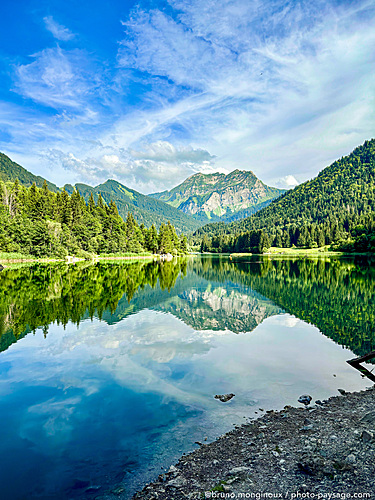

# Vanilla Light Gallery

A lightweight, dependency-free image gallery written in modern JavaScript. Inspired by [LightGallery.js](https://www.lightgalleryjs.com/), but kept minimal and extensible.

## Features

- Fullscreen modal on image click
- Keyboard navigation
- Responsive grid layout
- Minimal, customizable styles

## Demo

[Live Demo Here](#)

## Usage

```html
<script type="module" src="js/main.js"></script>
```

```html
<body>
  <div class="gallery" id="gallery">
    
    
    
    <!-- Add more images -->
  </div>

  <div class="lightbox" id="lightbox">
    <span class="close">&times;</span>
    
    <div class="nav">
      <span class="prev">&#10094;</span>
      <span class="next">&#10095;</span>
    </div>
  </div>

  <script type="module" src="js/main.js"></script>
</body>
```
